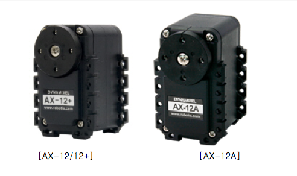
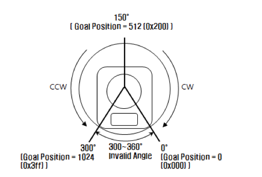

Servomoteur - Dynamixel AX12 
=============================

Caractéristiques  
---------------

Un servomoteur est un système asservi capable de maintenir une opposition à un effort statique . 
C’est donc une sorte de moteur qui est capable d’atteindre une vitesse et un angle déterminé .
On transmet au servomoteur des ordres sous forme de largeur d’impulsion appelée PWM . On envoi 
une impulsion et c’est le temps de l’impulsion qui détermine l’angle à fournir par les 
servomoteurs. 
Pour comprendre son utilisation je vais rappeler certaines de ces caractéristiques .



#### Caractéristiques du modèle AX-12

* Poids : 54,6g
* Dimension : 32mm * 50mm * 40mm
* Angle autorisé : 0 à 300° 
* Résolution : 0.29°
* Tension alimentation : 9 ~ 12V 
* Type Protocole : Half duplex Asynchronous Serial Communication (8bit,1stop,No Parity)
* ID : de 0 à 253 identifiant possible 
* Lecture possible : T°, tension, position..


#### Angle limite 



On peut aisément visualiser la position du 0° et la course possible du servomoteur . 
Quand nous donnons une valeur d’angle nous la donnons entre 0 à 1023 qui correspond à
une valeur d’angle entre 0 et 300 ° . 
Si je veux 150° je dois envoyer la valeur de 511,5 et mon servomoteur se positionnera en réalité 
à la position de notre 0 conventionnel. 
Si nous l’utilisons en « Wheel Mode » le servomoteur peut tourner sur 360° sans problème. 


#### Vitesse

##### Join Mode 

Nous envoyons une valeur entre 0 et 1023 où 1023 est la vitesse maximale du servomoteur. 
L’unité vaut 0,111 rpm et la vitesse maximale est de 0,111*1023 = 113,553 rpm ( rotation par minute ).

##### Wheel Mode 

En Wheel mode il faut connaitre la notion de CCW et CW qui correspondent respectivement à la 
rotation en sens anti horaire et la rotation en sens horaire. 
On peut utiliser des valeurs entre 0 et 2047 . ( utilisation sera expliqué dans un autre document si nécessaire).

Utilisation
-------------

Pour utiliser les servomoteurs il faut d’abord intégrer les librairies DynamixelSerial.h et DynamixelSerial.cpp.
Cette librairie contient toutes les fonctions déjà faites qui nous seront utiles pour utiliser
les servomoteurs. 
Notre objectif est de parcourir la liste et de se familiariser avec les différentes possibilités. 

Je vais tout d’abord décrire un certain nombre d’entre elles puis ensuite les utiliser dans 2 
programmes très simples nous permettant de visualiser les angles et les différentes vitesses. 

#### Fonctions 

* Dynamixel.begin(BaudRate, RxPin, TxPin, DataControl) 
    * On initialise la communication série avec l’arduino
    * RxPin est la pin de réception données et TxPin pour la transmission de données

* Dynamixel.ping(ID)
    * Connaitre le statut du servomoteur. 

* Dynamixel.reset(ID)
    * Rétablir les réglages par défaut du Dynamixel. 

* Dynamixel.setID(ID, new ID ) 
    * Change l’ID du servomoteur.

* Dynamixel.move(ID ,Position)
    * Déplace le dynamixel jusqu’à la position correspondante. 0 à 1023  

* Dynamixel.movespeed(ID,Position,Speed)
    * On précise en plus la vitesse voulue. 

* Dynamixel.moveRW(ID,Position)
    * Enregistre l’instruction qui déplace le mécanisme jusqu’à une position correspondante.

* Dynamixel.moveSpeedRW(ID,Position,Speed)
    * Enregistre l’instruction 

* Dynamixel.action()
    * Exécute l’instruction sauvegardé dans le servo

* Dynamixel.setEndless(ID,Status) 
    * Active ou désactive la rotation en continue du servomoteur.
    * Statut : ON/OFF

* Dynamixel.turn(ID,Side,Speed) 
    * ID - Identifiant Servomoteur
    * Sens de rotation RIGHT/LEFT
    * Speed : Vitesse 0 à 1023 

* Dynamixel.torqueStatus(ID,Status)
    * Active ou désactive le mode couple du servomoteur.

* Dynamixel.LEDStatus(ID,Status)
    * Active ou désactive la LED.

* Dynamixel.readPosition(ID)
    * Renvoi de la valeur de la position.

* Dynamixel.readSpeed(ID)
    * Renvoi la vitesse en RPM. 

#### Exemples de programme 

Dans le même dossier j’ai insérer 3 programmes permettant de tester son servomoteur et 
de comprendre son utilisation en pratique. 

* TestAngle : le servo part de 0 et fait un tour complet en s’arrêtant à différents angles.

* TestLecture : un programme permettant de se familiariser avec la méthode de récupération d’
infomations sur le servomoteur.

* TestVitesse : Le programme parcourt une séquence utilisant toutes les fonctions nécessaire à la 
compréhension des vitesses avec le servo. 
<br><br>
<br><br>
<br><br>

 ##### TestLecture.ino : <br><br>


```C++
#include <DynamixelSerial.h>

int Temperature,Voltage,Position; //On va lire température, tension servo et position 

void setup(){
Dynamixel.begin(1000000,2);  
delay(1000);
}

void loop(){
  Temperature = Dynamixel.readTemperature(1); // Fonction pour lire T°
  Voltage = Dynamixel.readVoltage(1);         // Fonction pour lire tension
  Position = Dynamixel.readPosition(1);       // Fonction pour connaitre position
 
  Dynamixel.move(1,random(200,800));  // Deplacement instantanéee entre 200 et 800 
  
 Dynamixel.end();                 // Arrêt communication 
 Serial.begin(9600);              // Begin Serial Comunication
 
  Serial.print(" *** Temperature: ");   // Print the variables in the Serial Monitor
  Serial.print(Temperature);
  Serial.print(" Celcius  Voltage: ");
  Serial.print(Voltage);
  Serial.print("  Volts   Position: ");
  Serial.print(Position);
  Serial.println(" of 1023 resolution");
  
 Serial.end();                     // End the Serial Comunication
 Dynamixel.begin(1000000,2);         // Begin Servo Comunication
 
delay(1000);

}
```

##### TestVitesse.ino <br><br>

```C++
#include <SoftwareSerial.h>

#include <DynamixelSerial.h>

/* Ce programme va tester les fonctions pour gérer la vitesse
Il part de 0 à 150 à une vitesse faible, revient à 9 puis repart 
à 150 avec une vitesse plus elevé .. Il tourne ensuite dans le sens droit à
une certaine vitesse puis tourne dans le sens gauche .. */

void setup(){
 
Dynamixel.begin(1000000,2);  // Inicialize the servo at 1Mbps and Pin Control 2
delay(1000);

}

void loop(){

  Dynamixel.move(1,0);//On met le servo à 0 
  delay(1000);
  Dynamixel.moveSpeed(1,511.5,200);// On l'avance jusqu'à zero avec vitesse 200 
 //avec vitesse de 0,111 rpm * 200
  delay(2000); 
  Dynamixel.move(1,0);
  delay(1000);
  Dynamixel.moveSpeed(1,511.5,800);
  delay(1000);
  Dynamixel.setEndless(1,ON); //Rotation continue
  Dynamixel.turn(1,RIGTH,1000); // On bouge servo 1 
  // vers la droite avec vitesse de 1000*0,111
  delay(3000);
  Dynamixel.turn(1,LEFT,200);
  delay(3000);
  Dynamixel.setEndless(1,OFF);


 
delay(1000);

}


```

### TestAngle.ino 


```C++


#include <DynamixelSerial.h>

void setup()
{
pinMode(2, INPUT);
pinMode(3, INPUT);
pinMode(13, OUTPUT);
pinMode (12, OUTPUT);
digitalWrite(2, HIGH);
digitalWrite(3, LOW);
Dynamixel.begin(1000000, 7);
delay(1000);

}

void loop()
{ Dynamixel.move(1,0);
  Dynamixel.ledStatus(1,ON);
  delay(2000);
  
  //Très important : Angle 0 se situe à 210°
  // Nous n'avons pas accès aux 360 degré car il y a une zone morte 
  
  Dynamixel.move(1,204.6);// -45 degre visuel mais 60° vu par servo
  Dynamixel.ledStatus(1,OFF);
  delay(2000);
  
  Dynamixel.move(1,511.5);//0° visuel mais 150 vu par servo
  Dynamixel.ledStatus(1,ON);
  delay(2000);
  
  Dynamixel.move(1,818.4);//45° visuel mais 210 vu par servo
  delay(2000);
  
  Dynamixel.ledStatus(1,OFF);
  Dynamixel.move(1,1023);//300 degré par rapport au 0 défini 
  delay(2000);
 }


```

Crédits
-------

Nabil Nehri ( Le fichier sera encore complété par des informations que je peux ajouter quand elles seront nécessaires) 

http://fr.wikipedia.org/wiki/Servomoteur

http://mchobby.be/wiki/index.php?title=Servo-Moteur

http://www.pishrobot.com/files/products/datasheets/dynamixel_ax-12a.pdf